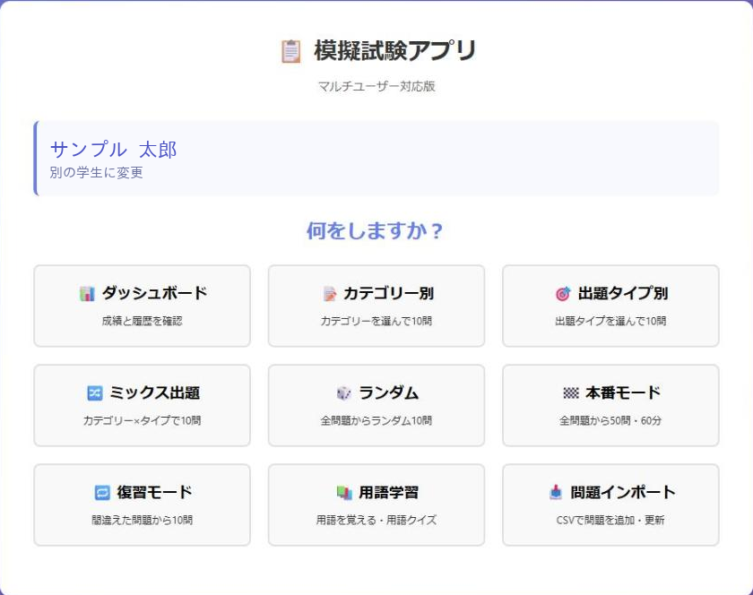
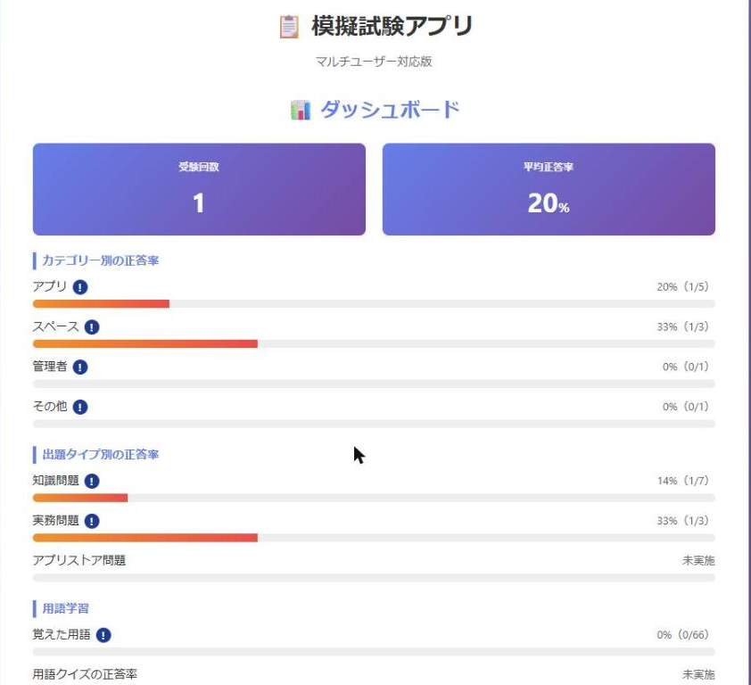
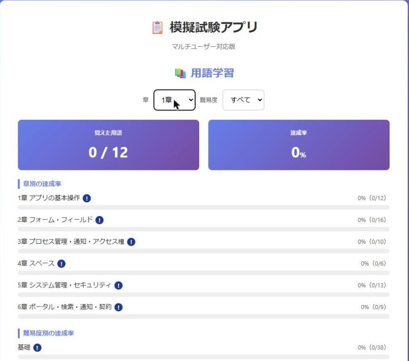

# gas-exam-app

kintoneアソシエイト試験の**模擬試験**と**用語学習**ができるWebアプリです。
Googleスプレッドシートをデータベースにして、Google Apps Script（GAS）だけで動きます。サーバーもドメインも不要で、デプロイして表示されたURLを開けばPCでもスマホでも使えます。

*A practice-exam and glossary web app for the kintone Associate certification, built entirely on Google Apps Script + Google Sheets.*

## このアプリならではの点

- **実際の受験経験にもとづく出題** — 実務問題・アプリストア問題は、kintoneアソシエイト試験を受けた経験から「本番で実際に問われた点」「受けてみて初めて分かった落とし穴」を洗い出して作成しています。参考書の要約ではなく、受験者がつまずく所を押さえた内容です。
- **基礎知識はサイボウズの練習問題をそのまま収録** — 知識問題は、サイボウズが提供している練習問題をそのまま取り込んでいます。公式の出題傾向と表現のまま学習でき、練習問題が改訂されたときもCSVを読み込ませるだけで最新の内容に差し替えられます。

> このリポジトリに含まれるのはアプリのコードのみです。問題データそのものは含まれていません。

## 画面

**メニュー** — 受験者を選び、9つの機能から選ぶ

**成績ダッシュボード** — カテゴリー別・出題タイプ別の正答率。70%未満の項目には警告バッジが付く

**用語学習** — 章別・難易度別の達成率と、フラッシュカード／用語クイズ

## 特徴

- **GASだけで完結** — 外部サーバー・DB・フレームワークなし
- **1ファイル構成** — 画面のHTML/CSS/JSまで `Code.gs` に含めているので、貼り替えるだけで更新できる
- **複数ユーザー対応** — 受験者を選んで学習履歴を個別に記録。名簿にない名前では保存できないよう検証あり
- **シートは自動作成** — 初回アクセス時に必要なシートと見出し行を用意する

## 機能

### 模擬試験

| モード | 内容 |
| --- | --- |
| カテゴリー別 | カテゴリーを選んで10問 |
| 出題タイプ別 | 出題タイプを選んで10問 |
| ミックス出題 | カテゴリー×タイプで10問 |
| ランダム | 全問題からランダム10問 |
| 本番モード | 全問題から50問・60分カウントダウン・時間切れ自動採点・合格ライン70%の判定バッジ |
| 復習モード | 過去に一度でも間違えた問題から10問 |

- 出題画面は進捗バー付きの一括採点型。単一選択・複数選択に対応
- 結果画面で「自分の回答／正解／解説／参考URL」と1問あたりの平均時間を表示
- ダッシュボードで受験回数・平均正答率に加え、カテゴリー別・出題タイプ別の正答率を表示（70%未満の項目には警告バッジ）

### 用語学習

- **フラッシュカード** — 用語→意味の順に確認し、「覚えた／まだ」をその場で記録
- **用語クイズ** — 覚えた用語から4択で出題し、1問ごとに記録
- 章別・難易度別の達成率と、用語クイズの正答率を表示

### 管理

- **問題インポート** — CSVから問題を一括で追加・更新（全置換／追記の両方に対応）
- 取り込んだ版を `data_version` シートに記録

## データ構成

| シート | 役割 | 主な列 |
| --- | --- | --- |
| `questions` | 問題マスタ | question_id / question_category / question_type / select_type / question |
| `choices` | 選択肢と解説 | question_id / choice_no / choice_text / explanation_text / explanation_url / is_correct |
| `students` | 受験者名簿 | student_name / display_order |
| `history` | 受験履歴（1回1行） | history_id / exam_datetime / student_name / exam_mode / total_count / total_score / correct_rate / duration_seconds |
| `history_results` | 解答明細 | history_id / row_no / question_id / question_text / selected_answer / judgment / explanation_text / explanation_url |
| `terms` | 用語マスタ | term_id / chapter / term / definition / level / explanation_url |
| `term_progress` | 覚えた用語の記録 | term_id / student_name / learned_at |
| `term_quiz_history` | 用語クイズの記録（1回答1行） | quiz_id / exam_datetime / student_name / term_id / chapter / level / judgment |
| `data_version` | 問題データの取り込み履歴 | version / target_exam / imported_at / imported_count |

## セットアップ

1. Googleスプレッドシートを新規作成する
2. **拡張機能 → Apps Script** を開き、`Code.gs` の中身をこのリポジトリのコードに置き換えて保存する
3. **デプロイ → 新しいデプロイ → ウェブアプリ**（実行するユーザー：自分／アクセスできるユーザー：全員）
4. 表示された `/exec` のURLを開く。必要なシートは自動で作成される
5. `students` シートに受験者名を入れる（アプリの画面からも追加できる）
6. `questions` / `choices` / `terms` にデータを入れる

## サンプルデータ

`sample-data/` に動作確認用のダミーデータを置いています。実際の試験問題ではなく、データの形式を示すための見本です。各CSVの中身をそのまま対応するシートに貼り付ければ、問題データがなくても一通り動かせます。

| ファイル | 貼り付け先のシート |
| --- | --- |
| `questions.sample.csv` | `questions` |
| `choices.sample.csv` | `choices` |
| `terms.sample.csv` | `terms` |
| `students.sample.csv` | `students` |

貼り付けるときは、`SAMPLE-001` のようなIDが日付に変換されないよう、インポート時の「テキストを数値、日付、数式に変換する」をオフにしてください。

## 技術メモ

- 画面HTMLは `doGet` 内で生成し、データのやり取りは `fetch` ではなく `google.script.run` で行う。これにより `file://`・CORS・Googleアカウントの多重ログインといった問題を回避している
- スプレッドシートは `1-12` のような問題IDを日付として保存してしまうことがあるため、`qidKey_` で正規化してから突合している
- 章の絞り込みは、章名（`1章 アプリの基本操作`）から章番号だけを取り出して照合する
- 表記ゆれ対策として、カテゴリー等の一致判定は `normKey_`（NFKC正規化＋不可視文字除去＋トリム）を通す

## ライセンス

MIT
